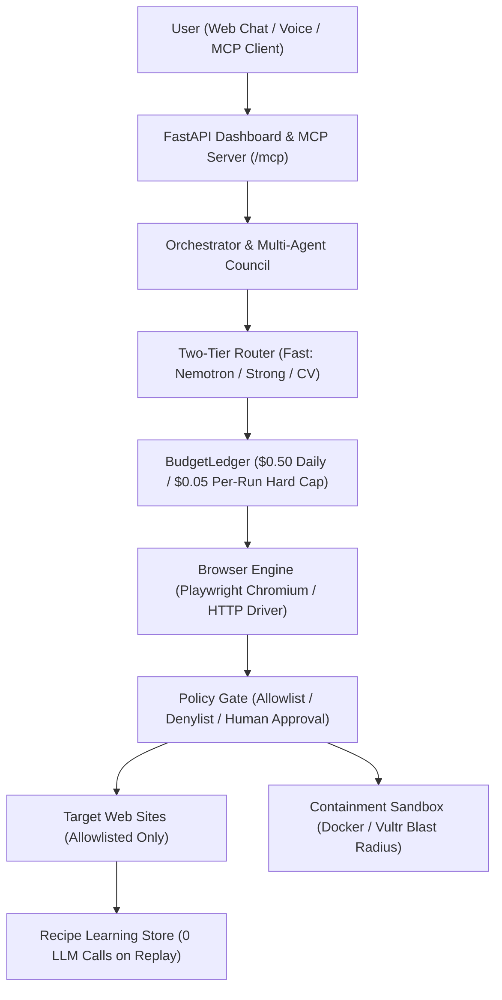

# Grasshopper

[](LICENSE)
[]()
[](docs/AUDIT.md)

Grasshopper is an open-source, multi-step browser AI agent that operates web browsers like a human. It turns repetitive manual browser workflows into safe, budgeted, self-healing automations via a single natural-language prompt or voice command. Live deployment: [halil.devnet](https://halil.devnet) (or GitHub: [https://github.com/grasshopper-agent/grasshopper](https://github.com/grasshopper-agent/grasshopper)).

Once a workflow is successfully completed, Grasshopper learns the recipe and replays it on subsequent runs with **zero model calls**, driving marginal inference cost to zero.

---

## 3-Command Setup

```bash
git clone https://github.com/grasshopper-agent/grasshopper.git && cd grasshopper
bash scripts/setup.sh
make run
```

`make run` serves the dashboard on port `8080` (binds `127.0.0.1` by default) and the local sandbox sites on port `8090`. No external API keys are required; **mock mode is the deterministic default**.

---

## 60 Seconds for the Jury

To evaluate Grasshopper in under 60 seconds with zero external dependencies and zero cost:

```bash
make judge
```

This command:
1. Launches a deterministically seeded scenario.
2. Simulates natural language task intake, multi-step planning, and browser interactions.
3. Verifies the `BudgetLedger` hard spending cap and `ApprovalGate` human sign-off policy.
4. Generates a static jury playback page at `site/index.html` with step-by-step screenshots.
5. Official 68-second native Chromium video walkthrough available at [`videos/main_demo.mp4`](videos/main_demo.mp4) (authentic browser execution with zero overlay artifacts).

---

## Run on Nebius Token Factory in 3 Minutes

To test live agent decisions with Nebius Token Factory (`https://api.tokenfactory.nebius.com/v1`) and `nvidia/Nemotron-3_5-Lightning`:

```bash
make nebius-demo
```

This command:
1. Connects to the Token Factory `/chat/completions` endpoint.
2. Sends real DOM state to the Fast model tier and parses valid structured JSON actions.
3. Records actual token and USD expenditure ($0.0001 level) on the `BudgetLedger`.

---

## Architecture



---

## Real-World Benchmark

Measurements from [docs/RELIABILITY_REAL.md](docs/RELIABILITY_REAL.md) across 5 real web benchmarks evaluated with live **Nebius Nemotron** (`nvidia/Nemotron-3_5-Lightning`, N=3).

| Scenario | Target Site | Runs | Run 1 LLM Calls | Run 1 Tokens | Run 1 Real Cost | Run 1 Duration | Run 2 (Recipe Replay) |
| :--- | :--- | :---: | :---: | :---: | :---: | :---: | :---: |
| **R1** | books.toscrape.com (Cheapest 4★ book) | 3 | 22 | 19,272 | $0.003814 | 230.2s | 20 calls |
| **R2** | saucedemo.com (Add to cart & checkout) | 3 | 3 | 702 | $0.000140 | 10.9s | 3 calls |
| **R3** | news.ycombinator.com (Top 3 HN headlines) | 3 | 2 | 2,220 | $0.000444 | 40.7s | 3 calls |
| **R4** | export.arxiv.org (Official API paper summary) | 3 | 6 | 2,941 | $0.000588 | 39.2s | 3 calls |
| **R5** | the-internet.herokuapp.com (Robustness test) | 3 | 5 | 1,834 | $0.000108 | 41.6s | 5 calls |
| **Total** | **5 Live Scenarios** | **15** | **38** | **26,969** | **$0.017731** | **362.6s** | **Learning active** |

### Nebius Model Routing Benchmark (Fast vs Strong)

Summary extracted from [docs/NEBIUS_BENCH.md](docs/NEBIUS_BENCH.md):

| Scenario | Fast (`nvidia/Nemotron-3_5-Lightning`) | Strong (`nvidia/Nemotron-3-Ultra-550b-a55b`) | Savings |
| :--- | :---: | :---: | :---: |
| **R1** | 4.44s · 82 tokens · $0.000082 | 4.70s · 111 tokens · $0.000555 | 85% cost savings |
| **R2** | 12.12s · 76 tokens · $0.000076 | 0.82s · 76 tokens · $0.000380 | 80% cost savings |
| **R3** | 16.03s · 68 tokens · $0.000068 | 2.24s · 98 tokens · $0.000491 | 86% cost savings |

---

## Security Architecture

Grasshopper is built with a **Containment-First** philosophy designed for unattended execution without risk of financial or data loss:

1. **Hard Spend Ceiling:**
   - Enforced by `grasshopper/core/budget.py` (`BudgetLedger`).
   - Default caps: **$0.50 / day** and **$0.05 / run**.
   - The model router calculates an estimate and reserves catalog tokens *before* every API call. If a threshold is crossed, execution stops immediately and a notification is dispatched.
2. **Domain Allowlist & Denylist:**
   - Enforced by `grasshopper/realweb/policy.py`.
   - Only explicitly approved domains (`REAL_SITES_ALLOWLIST`) can be contacted.
   - High-risk destinations (social networks, OAuth/Google login, payment checkout portals) are permanently blocked in `DENYLIST`.
   - `robots.txt` directives and request rate limits (e.g. 3.0s delay for arXiv) are strictly honored.
3. **Human Approval Gate:**
   - Any sensitive action (spending Solana, submitting checkout forms, sending external messages) creates a pending row in `/api/approvals`.
   - The agent pauses and waits for explicit approval via the web UI or Telegram bot (`@halil_ops_bot`).
4. **Blast Radius Zero Containment:**
   - Every execution writes `blast_radius.json`, tracking all modified files, contacted network domains, run duration, and token expenditures.
   - Sandbox runners execute inside CPU-, memory-, and network-isolated Docker containers or disposable Vultr cloud instances. *(Honesty note: Vultr API integration was not verified on a live funded account; it was tested against a local fake server `tests/fakes/vultr_app.py` and Docker isolation tests).*
5. **Out of Scope Security Boundaries:**
   - Live credit card transactions, financial payments, real authenticated user accounts (Google login, personal email), and social media platforms (Twitter/X, Meta) are strictly out of scope (`DENYLIST`) to prevent data leakage and account compromise. For detailed rationale, see [docs/COST.md](docs/COST.md).

---

## MCP Server Integration

Grasshopper mounts an official **MCP SDK 2.x Streamable HTTP server** at `/mcp/`. Any MCP-compatible client (including Claude Desktop, Alexa+, or custom agent networks) can inspect and control the agent:

- `run_task`: Queue natural-language browser workflows.
- `get_task_status`: Query live progress and results.
- `list_pending_approvals`: Inspect actions awaiting human sign-off.
- `approve`: Approve or reject gated operations.
- `council_ask`: Consult the multi-persona decision council.
- `store_check_old_listings`: Run automated e-commerce catalog audits.

---

## Turning Real Providers On

Switch from mock mode to live providers by setting keys in `.env` (no code modifications needed):

- **Nebius Token Factory / NVIDIA Nemotron:** `LLM_FAST_PROVIDER=nebius`, `NEBIUS_API_KEY`, `NEBIUS_BASE_URL`, `NEBIUS_FAST_MODEL`.
- **AWS Bedrock:** `LLM_STRONG_PROVIDER=bedrock`, `AWS_REGION`, `AWS_ACCESS_KEY_ID`, `AWS_SECRET_ACCESS_KEY`, `BEDROCK_MODEL_ID` (`ALLOW_BEDROCK=1` required).
- **Azure OpenAI & Speech:** `LLM_STRONG_PROVIDER=azure`, `AZURE_OPENAI_ENDPOINT`, `AZURE_OPENAI_API_KEY`, `STT_PROVIDER=azure`, `AZURE_SPEECH_KEY`.
- **Tavily Search:** `SEARCH_PROVIDER=tavily`, `TAVILY_API_KEY`.
- **Telegram Notifications:** `TELEGRAM_BOT_TOKEN`, `TELEGRAM_ALLOWED_USER_ID`.
- **Solana Devnet:** `WALLET_PROVIDER=solana_devnet`, `SOLANA_RPC_URL`, `WALLET_KEYPAIR_PATH` (mainnet RPC is strictly refused).

---

## Competitions and Submission Kits

Nothing is submitted automatically. The last step is always a person. Details and enablement steps are in [docs/COMPETITIONS.md](docs/COMPETITIONS.md).

| Competition | Flag | Deadline |
| --- | --- | --- |
| Amazon Alexa+ | `mcp` | 2026-10-23 |
| Amazon AWS Builder | `bedrock` | 2026-10-23 |
| Amazon Open Source | `mit` | 2026-10-23 |
| Nebius x NVIDIA | `nebius` | 2026-10-30 |
| Nebius Tavily bonus | `tavily` | 2026-10-30 |
| Open Agent Hackathon | `explainer` | 2026-10-20 |
| OpenCV AI Competition | `opencv` | 2026-10-26 |
| Colosseum Crypto World's Fair | `solana-devnet` | 2026-10-12 |
| Build With AI: Basics | `prototype` | 2026-10-26 |
| AI GENESIS | `agent` | 2026-11-02 |
| Rise of AI Agents | `agent` | 2026-11-03 |
| Kaggle Gemma 4 paper track | `gemma` | 2026-11-12 |
| HETIC AI Agents for Founders | `founder` | 2026-12-18 |
| Arbiter Hacks V1 | `agent` | 2026-12-21 |
| Microsoft Imagine Cup 2027 | `azure` | 2027-01-08 |
| Meta Global AI Developer Hackathon | `meta` | TBA |
| Vultr Agent Rush | `vultr` | 2026-11-08 |
| IEEE ClimateChain | `climate` | 2026-10-25 |
| YTU x Meta | `meta` | 2026-10-11 |
| ING Hubs | `ing` | 2026-10-04 |
| Kestra Hacktober | `human` | 2026-10-31 |
| ASUS UGen AI League | `asus` | 2026-10-14 |
| Hackster Nordic | `human` | unknown |
| AssemblyAI Voice Agent | `assemblyai` | 2026-09-30 |

Build all kits:

```bash
make kits
```

All kits are generated under `submissions/<competition-slug>/`. **Nothing is submitted automatically. The final submit step is always performed by a human.**

---

## Contributing

We welcome contributions! Please review [CONTRIBUTING.md](CONTRIBUTING.md) for development workflows, testing requirements (`make test` must remain green), and branch policies.

Report bugs or suggest features using our GitHub issue templates:
- [Bug Report](.github/ISSUE_TEMPLATE/bug_report.md)
- [Feature Request](.github/ISSUE_TEMPLATE/feature_request.md)

---

## License

This project is open-source under the [MIT License](LICENSE).
