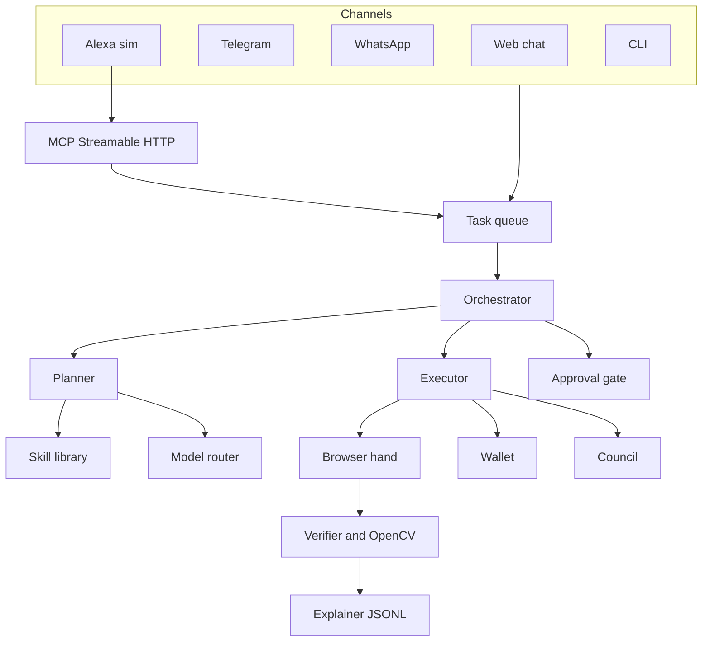

# Architecture

Grasshopper turns a sentence into a checked sequence of browser actions. Mock mode never needs a network key: the browser (or the HTTP sandbox driver) only touches the fake sites in `sandbox_web/`.

| Module | Role |
| --- | --- |
| `channels/` | Every ingress builds the same `Task`. |
| `queue/` | SQLite queue plus a regex clock for English and Turkish times. At most two tasks run at once. |
| `core/planner.py` | Playbook match first. The strong model is asked only on a miss, and invalid JSON is retried twice. |
| `core/router.py` | fast / strong / vision / repair. Each call logs tier, provider, tokens, and a cost estimate. |
| `browser/` | Action schema. Playwright when a browser launches; otherwise an HTTP driver with the same selectors. |
| `browser/vision.py` | OpenCV 5 contours and `absdiff` change ratio. |
| `core/verifier.py` | Criteria, then the visual diff, then an optional fast-model yes/no. |
| `memory/` | Hashing vectors and YAML playbooks. A new plan becomes approved after two successes. |
| `approvals/` | Risky steps wait. Timeout cancels them. |
| `mcp_server/` | Official MCP SDK, Streamable HTTP, mounted at `/mcp`. |
| `sandbox_web/` | ai-alpha, ai-beta, shop, news, media, competitions, broken. |
| `publish/` | Frames, an ffmpeg slideshow, and a submission kit that never auto-submits. |

Real providers live next to their mocks. `get_provider()` in `grasshopper/config.py` is the only switch. A missing key logs a warning and returns the mock.
